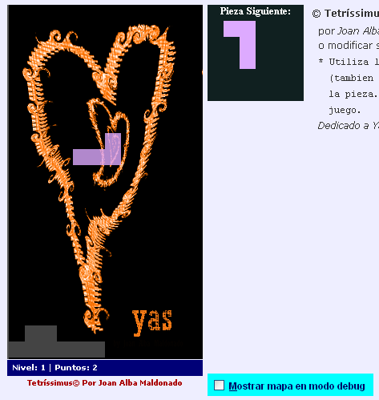

Tetrissimus 
============ 
by [Joan Alba Maldonado](https://joanalbamaldonado.com/) (joanalbamaldonadoNO_SPAM_PLEASE AT gmail DOT com, without NO_SPAM_PLEASE)

Tetris game totally written in DHTML.

Version: 0.15a 
- Date: 7th March 2006, last changes beyond 16th August 2006 (approximately).

You can donate at http://sourceforge.net/donate/index.php?group_id=173643

## Description

Open source Tetris clone totally written in DHTML (HTML, CSS and JavaScript).

It is my third DHTML game and was made in early 2006.

Editing the game code in order to add new pieces with different shapes or change the current ones or even delete them is very easy. You can also change the game behaviour easily by editing many of the configuration variables which are at the beginning of the script. To change the background image you just need to replace it with another one.

This game only uses one image for the background which is not necessary to make it work, so all the rest you can see has been made using just pure HTML and CSS.

Official languages are Spanish and English.

You can find other modified and adapted versions of this game on the Internet, including one Opera widget and even a Drupal module found at https://www.drupal.org/project/tetris

This game has been tested under BeOS, Linux, NetBSD, OpenBSD, FreeBSD, Windows, Mac OS X and others.

Play online in English: http://tetrissimus.tuxfamily.org/tetrissimus_english/

Play online in English (mirror): http://www.dhtmlgames.com/tetrissimus/tetrissimus_english/

Play online in Spanish: http://tetrissimus.tuxfamily.org/tetrissimus_spanish/

Play online in Spanish (mirror): http://www.dhtmlgames.com/tetrissimus/tetrissimus_spanish/

Official web site: http://tetrissimus.tuxfamily.org/ (mirror at http://www.dhtmlgames.com/tetrissimus/).

## License

This project can be used, reproduced, distributed and modified freely for any non-commercial purposes but always keeping the author's name and copyright clauses. Other than that, just use this project as you wish but never sell it!